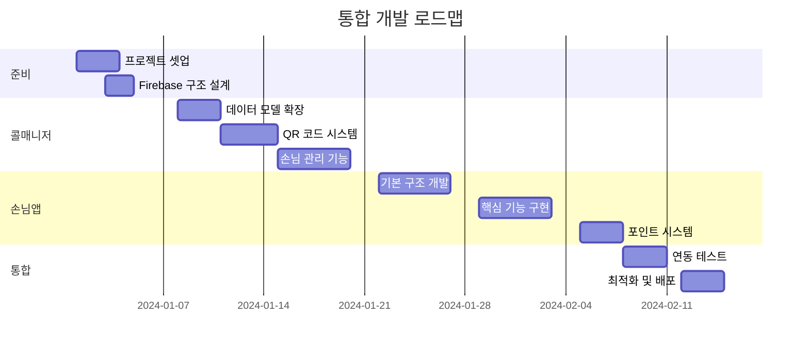

# 대리운전 플랫폼 통합 개발 로드맵

## Executive Summary

손님앱과 콜매니저를 연동하여 사무실별 독립적인 손님 관리 시스템을 구축하는 8주간의 개발 로드맵입니다.

### 핵심 목표
- ✅ 사무실별 손님 독점 관리 시스템
- ✅ QR 코드 기반 손님-사무실 바인딩
- ✅ 포인트 및 등급 시스템
- ✅ 완벽한 양방향 연동

---

## 📅 전체 일정 (8주)



---

## Week 1: 프로젝트 준비 및 설계

### 월요일-화요일: 환경 구성
```bash
✓ Firebase 프로젝트 설정
✓ Firestore 구조 설계
✓ Security Rules 작성
✓ 개발 환경 구축
```

### 수요일-목요일: 데이터 모델 설계
```kotlin
// 공통 데이터 구조 정의
- CustomerInfo
- PointTransaction
- OfficeSettings
- QRCodeData
```

### 금요일: 설계 검토
- 아키텍처 리뷰
- 보안 체크리스트 확인
- 일정 조정

**산출물**:
- [ ] Firebase 프로젝트 생성 완료
- [ ] 데이터베이스 스키마 문서
- [ ] API 설계 문서

---

## Week 2: 콜매니저 - 백엔드 확장

### 월요일-화요일: 데이터 모델 구현
```kotlin
// CallInfo 확장
@PropertyName("customerId") var customerId: String?
@PropertyName("customerGrade") var customerGrade: String?
@PropertyName("createdFrom") var createdFrom: String?
```

### 수요일-목요일: 서비스 레이어
```kotlin
class CustomerService {
    fun registerCustomer()
    fun updateGrade()
    fun calculatePoints()
}
```

### 금요일: Repository 패턴 구현
- CustomerRepository
- PointRepository
- QRCodeRepository

**산출물**:
- [ ] 확장된 데이터 모델
- [ ] 서비스 클래스 구현
- [ ] 단위 테스트 작성

---

## Week 3: 콜매니저 - QR 코드 시스템

### 월요일-화요일: QR 생성 기능
```kotlin
// QR 코드 생성
fun generateQRCode(officeId: String): QRCodeData {
    return QRCodeData(
        officeId = officeId,
        inviteCode = generateUniqueCode(),
        timestamp = now()
    )
}
```

### 수요일-목요일: QR 관리 화면
- QRCodeManagementScreen 개발
- 다운로드/공유 기능
- 디자인 커스터마이징

### 금요일: 딥링크 구현
- 앱 스토어 연동
- 파라미터 전달 시스템

**산출물**:
- [ ] QR 코드 생성 API
- [ ] QR 관리 화면 완성
- [ ] 딥링크 시스템 구축

---

## Week 4: 콜매니저 - 손님 관리 기능

### 월요일-화요일: 손님 목록 화면
```kotlin
@Composable
fun CustomerListScreen() {
    // 페이지네이션
    // 검색/필터
    // 정렬 옵션
}
```

### 수요일-목요일: 포인트 정책 설정
```kotlin
data class PointPolicy(
    val rates: Map<Grade, Int>,
    val thresholds: Map<Grade, Int>
)
```

### 금요일: 대시보드 통합
- 메인 메뉴 추가
- 통계 위젯 개발
- 알림 시스템 확장

**산출물**:
- [ ] 손님 관리 화면 완성
- [ ] 포인트 정책 설정 기능
- [ ] 대시보드 통합 완료

---

## Week 5: 손님앱 - 기본 구조

### 월요일: 프로젝트 생성
```xml
<!-- build.gradle -->
minSdk 24
targetSdk 34
compose_version = "1.5.4"
```

### 화요일-수요일: 기본 화면 구성
- SplashScreen
- QRScanScreen
- PhoneAuthScreen
- MainScreen

### 목요일-금요일: Navigation 구조
```kotlin
@Composable
fun AppNavigation() {
    NavHost(startDestination = "splash") {
        composable("splash") { SplashScreen() }
        composable("qr_scan") { QRScanScreen() }
        composable("auth") { PhoneAuthScreen() }
        composable("main") { MainScreen() }
    }
}
```

**산출물**:
- [ ] Android 프로젝트 생성
- [ ] 기본 화면 레이아웃
- [ ] Navigation 구조 완성

---

## Week 6: 손님앱 - 핵심 기능

### 월요일-화요일: QR 스캔 및 연동
```kotlin
class QRScanViewModel {
    fun scanQRCode(data: String) {
        // QR 데이터 파싱
        // 사무실 정보 저장
        // Firebase 연동
    }
}
```

### 수요일: Phone Authentication
```kotlin
private fun startPhoneVerification(phoneNumber: String) {
    PhoneAuthProvider.verifyPhoneNumber(
        phoneNumber,
        60,
        TimeUnit.SECONDS,
        this,
        callbacks
    )
}
```

### 목요일-금요일: 메인 기능
- 원터치 전화 걸기
- 위치 입력 시스템
- 자동 콜 생성

**산출물**:
- [ ] QR 스캔 기능 완성
- [ ] 전화번호 인증 구현
- [ ] 콜 생성 시스템 연동

---

## Week 7: 통합 및 포인트 시스템

### 월요일-화요일: 포인트 시스템 구현
```kotlin
// 손님앱
class PointViewModel {
    fun checkBalance()
    fun usePoints(amount: Int)
    fun getHistory()
}

// 콜매니저
class PointService {
    fun earnPoints(customerId: String, fare: Long)
    fun processTransaction()
}
```

### 수요일-목요일: 양방향 연동 테스트
- 콜 생성 → 콜매니저 확인
- 배차 완료 → 손님앱 알림
- 포인트 적립 → 실시간 반영

### 금요일: 통합 테스트
- End-to-End 시나리오 테스트
- 성능 테스트
- 보안 테스트

**산출물**:
- [ ] 포인트 시스템 완성
- [ ] 양방향 연동 완료
- [ ] 테스트 보고서

---

## Week 8: 최적화 및 배포

### 월요일-화요일: 최적화
```kotlin
// 성능 최적화
- 이미지 압축
- 코드 난독화
- 불필요한 의존성 제거
- 메모리 누수 체크
```

### 수요일: 배포 준비
- APK 서명
- Play Store 등록 준비
- 버전 관리 설정

### 목요일: 문서화
- 사용자 매뉴얼
- 관리자 가이드
- API 문서

### 금요일: 최종 검토 및 배포
- 체크리스트 확인
- 스테이징 배포
- 프로덕션 배포

**산출물**:
- [ ] 최적화된 앱 (< 15MB)
- [ ] Play Store 등록
- [ ] 완성된 문서

---

## 🎯 주요 마일스톤

| 주차 | 마일스톤 | 성공 기준 |
|------|---------|-----------|
| Week 2 | 콜매니저 백엔드 완성 | 모든 API 테스트 통과 |
| Week 4 | 콜매니저 UI 완성 | 손님 관리 기능 작동 |
| Week 6 | 손님앱 MVP | 기본 콜 생성 가능 |
| Week 7 | 통합 완료 | E2E 테스트 통과 |
| Week 8 | 출시 준비 | Play Store 승인 |

---

## 🚨 위험 요소 및 대응 방안

### 기술적 위험
| 위험 | 가능성 | 영향도 | 대응 방안 |
|-----|--------|--------|-----------|
| Firebase 한도 초과 | 중 | 높음 | 사용량 모니터링, 캐싱 적용 |
| QR 인식 실패 | 낮음 | 중간 | 수동 코드 입력 대체 |
| SMS 인증 실패 | 낮음 | 높음 | 재시도 로직, 대체 인증 |

### 사업적 위험
| 위험 | 가능성 | 영향도 | 대응 방안 |
|-----|--------|--------|-----------|
| 사용자 저항 | 중 | 중간 | 교육 자료 제공, 점진적 도입 |
| 경쟁사 모방 | 높음 | 낮음 | 빠른 시장 선점, 지속적 개선 |

---

## 📊 성공 지표 (KPI)

### 단기 목표 (3개월)
- [ ] 월간 활성 사용자(MAU): 500명
- [ ] 앱 통한 콜 비율: 30%
- [ ] 평균 앱 평점: 4.0 이상
- [ ] 포인트 사용률: 20%

### 중기 목표 (6개월)
- [ ] MAU: 2,000명
- [ ] 앱 콜 비율: 50%
- [ ] 재이용률: 60%
- [ ] 손님 등급 분포: 실버 이상 40%

### 장기 목표 (1년)
- [ ] MAU: 5,000명
- [ ] 앱 콜 비율: 70%
- [ ] 재이용률: 75%
- [ ] 타 지역 확장: 3개 지역

---

## 🛠️ 기술 스택

### 공통
- **Firebase**: Authentication, Firestore, FCM, Analytics
- **언어**: Kotlin
- **아키텍처**: MVVM + Clean Architecture

### 콜매니저
- **UI**: Jetpack Compose
- **DI**: Hilt
- **네트워크**: Retrofit + Coroutines

### 손님앱
- **UI**: Jetpack Compose
- **지도**: Kakao Maps SDK
- **QR**: ML Kit Barcode Scanning
- **위치**: Google Location Services

---

## 📝 체크리스트

### 개발 전
- [ ] Firebase 프로젝트 생성
- [ ] 개발 환경 구축
- [ ] Git 저장소 설정
- [ ] CI/CD 파이프라인 구성

### 개발 중
- [ ] 일일 스탠드업 미팅
- [ ] 주간 진행상황 리뷰
- [ ] 코드 리뷰 프로세스
- [ ] 테스트 커버리지 80% 이상

### 개발 후
- [ ] 사용자 매뉴얼 작성
- [ ] 교육 영상 제작
- [ ] 피드백 수집 체계 구축
- [ ] 모니터링 대시보드 설정

---

## 🎬 다음 단계 (Post-Launch)

### Phase 2 (3개월 후)
- iOS 버전 개발
- 예약 기능 추가
- 기사 위치 실시간 추적

### Phase 3 (6개월 후)
- 카드 결제 연동
- AI 기반 요금 예측
- 법인 고객 관리

### Phase 4 (1년 후)
- 전국 확장
- 프랜차이즈 시스템
- 빅데이터 분석 플랫폼

---

## 📞 연락처

- **프로젝트 관리자**: [PM 이름]
- **기술 리더**: [Tech Lead 이름]
- **QA 담당**: [QA 이름]
- **긴급 연락처**: [전화번호]

---

*이 로드맵은 프로젝트 진행 상황에 따라 조정될 수 있습니다.*

**최종 업데이트**: 2024-01-01
**버전**: 1.0.0